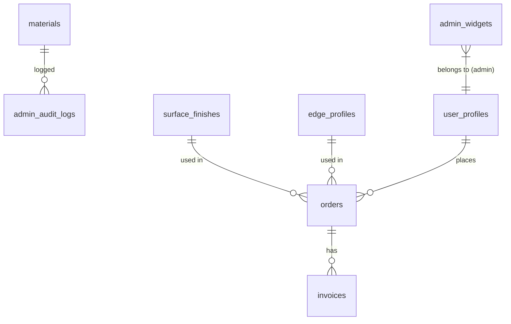

# Implementation Plan - Backend & Schema Fixes

This plan addresses Pydantic validation errors in the backend and missing table definitions in the database schema.

## 1. Backend: Pydantic Validation Errors
In `backend/app/api/admin/materials.py`, the `MaterialUpdate` model fields need explicit default values to be truly optional in Pydantic V2.

### Changes:
- Modify `MaterialUpdate` in [`backend/app/api/admin/materials.py`](backend/app/api/admin/materials.py):
  - `name: str | None = None`
  - `inventory_count: int | None = None`
  - `is_active: bool | None = None`

## 2. Schema: Missing Database Migrations
Add missing table definitions to [`scripts/phase4_schema.sql`](scripts/phase4_schema.sql) to ensure complete database initialization.

### New Tables to Add:
- `admin_audit_logs`
- `surface_finishes`
- `edge_profiles`
- `admin_widgets`

### SQL Definitions (based on `domain.py`):

```sql
-- 5. Admin Audit Logs
CREATE TABLE IF NOT EXISTS public.admin_audit_logs (
  id SERIAL PRIMARY KEY,
  admin_id TEXT NOT NULL,
  action TEXT NOT NULL,
  resource_type TEXT NOT NULL,
  resource_id TEXT,
  old_value TEXT,
  new_value TEXT,
  ip_address TEXT,
  user_agent TEXT,
  request_id TEXT,
  created_at TIMESTAMPTZ DEFAULT NOW()
);

-- Enable RLS on admin_audit_logs (Admin only)
ALTER TABLE public.admin_audit_logs ENABLE ROW LEVEL SECURITY;

-- 6. Surface Finishes
CREATE TABLE IF NOT EXISTS public.surface_finishes (
  id SERIAL PRIMARY KEY,
  name TEXT NOT NULL,
  cost_sqm NUMERIC(10, 2) NOT NULL,
  created_at TIMESTAMPTZ DEFAULT NOW()
);

-- Enable RLS on surface_finishes
ALTER TABLE public.surface_finishes ENABLE ROW LEVEL SECURITY;

-- 7. Edge Profiles
CREATE TABLE IF NOT EXISTS public.edge_profiles (
  id SERIAL PRIMARY KEY,
  name TEXT NOT NULL,
  cost_m NUMERIC(10, 2) NOT NULL,
  created_at TIMESTAMPTZ DEFAULT NOW()
);

-- Enable RLS on edge_profiles
ALTER TABLE public.edge_profiles ENABLE ROW LEVEL SECURITY;

-- 8. Admin Widgets
CREATE TABLE IF NOT EXISTS public.admin_widgets (
  id SERIAL PRIMARY KEY,
  admin_id TEXT NOT NULL,
  title TEXT NOT NULL,
  metric_type TEXT NOT NULL,
  chart_type TEXT NOT NULL,
  config TEXT DEFAULT '{}',
  created_at TIMESTAMPTZ DEFAULT NOW()
);

-- Enable RLS on admin_widgets (Admin only)
ALTER TABLE public.admin_widgets ENABLE ROW LEVEL SECURITY;
```

## 3. RLS Policies
Basic RLS policies should be added for these tables. For `admin_*` tables, access should be restricted to admin users (logic usually handled at the Supabase/Postgres role level or via specific policies).

```sql
-- Example for public tables (read-only for all, write for admin)
CREATE POLICY "Allow public read on surface_finishes" ON public.surface_finishes FOR SELECT USING (true);
CREATE POLICY "Allow public read on edge_profiles" ON public.edge_profiles FOR SELECT USING (true);
```

---

## Mermaid Diagram: Data Relationships


